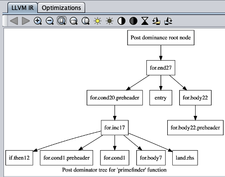

# LLVM GUI

This tool allows you to run simple C programs in a code editor, select an order of optimizations, and even view
the control-flow-graph, dominator tree, or the post-dominator tree. This is a pedagogical tool that has been
adopted from the [GUI](https://github.com/LouisJenkinsCS/llvm-jvm-gui) used in my [LLVM-JVM project](https://github.com/LouisJenkinsCS/LLVM-JVM).
This has been modified to run C code rather than requiring the LLVM-JVM to compile Java down to Bytecode and then down to LLVM IR.

## Build Instructions

**Dependencies**

* `clang`
* `llvm`

**Build from Release**

'java -jar LLVM-Simple-GUI.jar [filename]' where 'filename' is an optional C file.

**Build from Source**

Advised to use NetBeans, as no Makefile will be provided!

## What does it do?

**Includes a Code Editor with basic [Syntax Highlighting](https://github.com/bobbylight/RSyntaxTextArea)!**

**See the CFG, DOM Tree, and POSTDOM Tree!**

**Select from various optimizations**

**See Before-And-After Transformations!**

**View Basic Block Headers Only for Larger Functions!**

